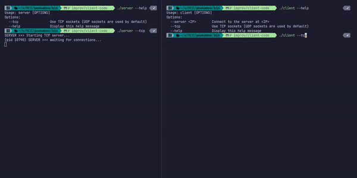

# peekaboo
Projeto da Disciplina MC833 - Programação de Redes de Computadores

O **peekaboo** é uma aplicação simples com o fim de gerenciar perfis profissionais e acadêmicos de pessoas. A princípio o software opera sobre o protocolo TCP e em breve também será compatível com UDP. O nome **peekaboo** foi uma sugestão do ChatGPT com base nos requisitos do sistema e faz referência a brincadeira de esconde-esconde feita com crianças, fazendo alusão às informações dos perfis que a aplicação revela.

## Build

Para fazer o `build` da aplicação basta utilizar o seguinte procedimento:

```bash
chmod +x scripts/build_peekaboo.sh
scripts/build_peekaboo.sh
```

Com isso, os binários do cliente (`client`) e do servidor (`server`) estarão disponíveis no diretório bin. Além disso, uma instancia de banco de dados com 20 perfis estara disponível em `bin/profiles.db`.

## Run

Devido a localização do arquivo com o banco de dados, para que o **peekaboo** funcione corretamente é necessário executar os binário dentro do diretório `bin`.

Primeiro execute o binário do servidor utilizando o comando:

```bash
cd bin
./server
```

Ainda no diretório `bin`, inicie o binário do cliente, indicando opcionalmente o ip do servidor (localhost por padrão).
```bash
./client <server_ip>
```

## Exemplo de funcionamento

No diretório de exemplos, deixamos um vídeo ilustrando o funcionamento do [**peekaboo**](examples/peekaboo_demo.mp4).

